# Eximia Code · Trabajo Práctico Grupal 1

**Desarrollo de Sistemas Web · Front End · 2026 · 2º año 2.º Cuatrimestre**  
**Tecnicatura Superior en Desarrollo de Software · IFTS 29**  
**Docente: Luciano Martínez.**
**Grupo 12 · TP1**

> Sitio web grupal desarrollado con HTML5 semántico, CSS3 y JavaScript para presentar a **Eximia Code**, un equipo ficticio orientado al desarrollo de software para logística inteligente B2B, planificación de rutas, trazabilidad y operación de última milla, donde pueden conocer a los integrantes del grupo, sus perfiles, habilidades, peliculas y discos favoritos. Además pueden contactar al grupo o al perfil individual y recorrar la bitácora de trabajo.

## Índice

1. [Enlaces del proyecto](#1-enlaces-del-proyecto)
2. [Integrantes](#2-integrantes)
3. [Propósito y propuesta](#3-propósito-y-propuesta)
4. [Tecnologías utilizadas](#4-tecnologías-utilizadas)
5. [Estructura del proyecto](#5-estructura-del-proyecto)
6. [Identidad visual y guía de estilos](#6-identidad-visual-y-guía-de-estilos)
7. [Decisiones UX/UI](#7-decisiones-uxui-tomadas-antes-de-comenzar)
8. [Responsive Design](#8-responsive-design)
9. [Accesibilidad y teclado](#9-accesibilidad-y-navegación-por-teclado)
10. [JavaScript e interacciones](#10-javascript-e-interacciones-dinámicas)
11. [Formularios](#11-formularios-de-contacto)
12. [Imágenes y optimización](#12-imágenes-y-optimización-de-carga)
13. [Bitácora](#13-bitácora)
14. [Colaboración y commits](#14-plan-de-trabajo-y-colaboración-github)
15. [Pruebas realizadas](#15-pruebas-realizadas)
16. [Capturas](#16-capturas-de-pantalla)
17. [Uso de IA y autoría](#17-uso-de-inteligencia-artificial-y-autoría)
18. [Evolución](#18-evolución-para-próximos-trabajos)
19. [Checklist frente a la consigna](#19-checklist-final-frente-a-la-consigna)
20. [Conclusión](#20-conclusión)
21. [Criterio final de teclado](#21-navegación-por-teclado-criterio-final)
22. [Preferencias del usuario y animación](#22-preferencias-del-usuario-y-accesibilidad-ampliada)

---

## 1. Enlaces del proyecto

- **Sitio publicado en Vercel:** https://tp1-grupo-12.vercel.app/index.html

- **Repositorio grupal entrega:** https://github.com/fiorellaalarcon/tp1-grupo12

> La URL de Vercel fue verificada sobre la versión final integrada del repositorio grupal.

---

## 2. Integrantes

| Perfil | Integrante | Rol | Ciudad | GitHub |
|---|---|---|---|---|
| 1 | **Fiorella Alarcón** | Product & Frontend | Posadas | https://github.com/fiorellaalarcon/ |
| 2 | **Axel Alva** | Backend Developer | CABA | https://github.com/axelalva2023/ |
| 3 | **Malena Jasque** | UX/UI & QA | Posadas | https://github.com/malenajasque/ |
| 4 | **Javier Churquina** | Data & Routing | CABA | https://github.com/Freddy1537/ |
| 5 | **Selene Pais** | DevOps & Docs | CABA | https://github.com/Selepais/ |

Cada perfil individual mantiene su enlace de GitHub visible. En la portada, las tarjetas de integrantes son enlaces únicos y completamente clickeables hacia el perfil correspondiente, para evitar destinos duplicados dentro de una misma tarjeta.

---

## 3. Propósito y propuesta

**Eximia Code** representa un equipo interdisciplinario que desarrolla soluciones digitales para empresas vinculadas con distribución gastronómica, logística refrigerada y operación B2B.

La portada presenta:

- identidad y propósito del grupo;
- interacción dinámica de optimización/recalculo de rutas;
- panel visual del producto;
- listado completo de integrantes;
- estadísticas del equipo;
- formulario de contacto;
- navegación principal y navegación de pie;
- acceso a la Bitácora.

Cada perfil presenta una estructura común para facilitar la comparación y la navegación:

1. foto/avatar;
2. nombre, ciudad y edad;
3. rol profesional;
4. enlace a GitHub;
5. contacto;
6. interacción dinámica propia del rol;
7. navegación interna por anclas;
8. cuatro habilidades;
9. tres películas favoritas;
10. tres discos favoritos con carga de Spotify bajo demanda;
11. formulario de contacto;
12. navegación entre perfiles y acceso al resto del equipo.

---

## 4. Tecnologías utilizadas

- **HTML5 semántico**
- **CSS3**
- **JavaScript vanilla**
- **CSS Grid y Flexbox**
- **Google Fonts**
- **Devicon** para iconografía tecnológica
- **Spotify Embed** cargado bajo demanda en los discos
- **FormSubmit** como endpoint del formulario, utilizado mediante `fetch` para evitar redirecciones
- **Vercel** para publicación

No se utilizaron frameworks de frontend ni librerías JavaScript para la lógica principal del sitio.

---

## 5. Estructura del proyecto

```text
TP1-Grupo12/
├── index.html                  # portada
├── fiorella.html  axel.html  malena.html  javier.html  selene.html   # perfiles
├── bitacora.html               # proceso, problemas y soluciones
├── README.md
├── css/                        # un archivo por responsabilidad (orden de carga)
│   ├── 01-variables.css        # paleta, tipografías, temas claro/oscuro
│   ├── 02-base.css             # reset, foco, skip-link, botones, utilidades
│   ├── 03-layout.css           # header, menú, footer
│   ├── 04-portada.css          # hero, equipo, GitHub, estadísticas
│   ├── 05-perfil.css           # ficha, habilidades, películas, discos
│   ├── 06-formularios.css      # formularios y estados de error
│   ├── 07-bitacora.css         # etapas, trazabilidad, commits/PR y cierre
│   ├── 08-responsive.css       # breakpoints 1200 / 900 / 400 px
│   └── 09-accesibilidad.css    # reduced-motion, contrast, forced-colors, print
├── js/
│   ├── theme.js  skip-links.js  nav.js  forms.js  spotify.js   # módulos compartidos
│   ├── index.js                # interacción de la portada
│   ├── bitacora.js             # filtros e historial verificable de commits
│   └── fiorella.js  axel.js  malena.js  javier.js  selene.js   # una interacción propia del rol por perfil
├── img/                        # WebP: avatares, miniaturas -400, panel, logo, pósters, discos
├── docs/
│   ├── capturas/               # capturas reales del sitio y guía de evidencias
│   └── IA-PROMPTS.md           # registro de prompts y criterios de uso de IA
```

### Responsabilidad de cada archivo

- `index.html`: portada, presentación del equipo, perfiles de GitHub, estadísticas y contacto grupal.
- `fiorella.html`, `axel.html`, `malena.html`, `javier.html`, `selene.html`: perfiles 1 a 5.
- `bitacora.html`: decisiones, dificultades y soluciones, cambios y checklist.
- `css/*.css`: cada archivo lleva un encabezado que explica su alcance y comentarios por bloque.
- `js/theme.js`: tema claro/oscuro con persistencia y preferencia del sistema.
- `js/skip-links.js`: saltos de contenido y «Volver arriba».
- `js/nav.js`: menú hamburguesa accesible con cierre por Escape.
- `js/forms.js`: validación ARIA y envío con `fetch`.
- `js/spotify.js`: iframes de Spotify bajo demanda.
- `js/index.js` y `js/<integrante>.js`: interacciones dinámicas de portada y perfiles.
- `js/bitacora.js`: filtros del historial y actualización progresiva del registro de commits desde la API pública de GitHub, con respaldo en la instantánea HTML.


### Por qué los HTML están en la raíz y CSS/JS en carpetas

**Decisión de arquitectura:** `index.html`, las cinco páginas de perfil y `bitacora.html` se mantienen en la raíz porque son las páginas navegables directamente por el sitio. Las hojas de estilo y los scripts se agrupan en `css/` y `js/` para separar recursos reutilizables de las páginas y hacer explícita la responsabilidad de cada archivo. Los recursos visuales se concentran en `img/` y la evidencia/documentación adicional en `docs/`.

Esta organización responde directamente a la consigna: `index.html` y las páginas individuales permanecen en la raíz; CSS y JavaScript están separados en carpetas; las imágenes se mantienen en `img`. Además, la estructura facilita la colaboración porque los integrantes pueden trabajar sobre módulos concretos y los commits dejan visible qué parte del proyecto se incorporó.

### Por qué el CSS está dividido en nueve archivos


**Decisión:** en lugar de utilizar un único style.css, el CSS se separó por responsabilidades y se carga en un orden definido desde cada HTML.

Cada archivo aborda un tema específico, lo que facilita encontrar, comprender y corregir reglas. El prefijo numérico (01- a 09-) establece el orden de lectura y carga.

Esta organización también facilita el trabajo grupal: permite realizar commits más pequeños y específicos por integrante y reduce los conflictos de merge, ya que es menos probable que dos personas modifiquen el mismo archivo al trabajar en distintos horarios. Si bien implica más archivos y solicitudes HTTP, son archivos pequeños y el impacto es bajo en el entorno de publicación utilizado (Vercel). Para un proyecto de producción podría optarse por concatenarlos o utilizar bundling.

Por estas razones, se eligió una estructura modular que favorece la colaboración, la trazabilidad de los commits y el mantenimiento del proyecto.

**Variables CSS:** los valores globales, como colores, tipografías, radios (--radius-sm/md), ancho máximo (--max), altura del header (--header-h), espaciado (--space-section), colores de marca (--spotify-green, --mono-on-dark) y duración de animaciones (--anim-duration), se concentran en css/01-variables.css. En pantallas de 400 px se redefine --header-h para que el header y la barra de anclas se ajusten de forma conjunta.

### Convenciones de código

- Sangría de **2 espacios** en HTML, CSS y JavaScript, sin tabuladores ni espacios finales (verificado con un script sobre los 7 HTML, 9 CSS y 11 JS).
- Comentarios por sección en los tres lenguajes: cada bloque explica *qué* resuelve y *por qué*.
- Sin selectores CSS duplicados ni reglas sin uso en la portada; las clases `error` y `success` se conservan porque las agrega `forms.js`.
- Un único `<h1>` por página, jerarquía `h1 > h2 > h3` sin saltos.

---

## 6. Identidad visual y guía de estilos

### Paleta

Se adoptó una lógica **60-30-10** como criterio de distribución visual: una base amplia de fondos, superficies secundarias y texto; una proporción intermedia para identidad y componentes; y acentos para acciones y estados. Paleta conforme criterios de accesibilidad y contraste WCAG.

La paleta se centraliza mediante variables CSS para mantener coherencia entre todas las páginas.

### Modo claro

| Variable | Hexadecimal | Uso |
|---|---|---|
| `--bg-primary` | `#FFFFFF` | fondo principal |
| `--bg-secondary` | `#F4F7F6` | secciones alternas |
| `--bg-surface` | `#E3EBE8` | tarjetas y superficies |
| `--text-primary` | `#070D1F` | texto principal |
| `--text-secondary` | `#1E293B` | texto secundario |
| `--border-color` | `#3A506B` | bordes |
| `--accent-primary` | `#00684D` | acción principal |
| `--accent-secondary` | `#005A80` | enlaces/acento secundario |
| `--focus-ring` | `#D9381E` | foco visible |

### Modo oscuro

| Variable | Hexadecimal | Uso |
|---|---|---|
| `--bg-primary` | `#0B132B` | fondo principal |
| `--bg-secondary` | `#111C3D` | secciones alternas |
| `--bg-surface` | `#1C2541` | tarjetas y superficies |
| `--text-primary` | `#FFFFFF` | texto principal |
| `--text-secondary` | `#E4E9F0` | texto secundario |
| `--border-color` | `#6B829B` | bordes con contraste mejorado |
| `--accent-primary` | `#06D6A0` | acción principal |
| `--accent-secondary` | `#48CAE4` | enlaces/acento secundario |
| `--focus-ring` | `#FFB703` | foco visible |

La combinación se eligió para transmitir tecnología, precisión, logística y trazabilidad sin utilizar una estética excesivamente saturada.

### Tipografías

- **Orbitron:** identidad de marca y títulos `h1`, especialmente para reforzar el carácter tecnológico.
- **Space Grotesk:** encabezados secundarios.
- **IBM Plex Sans:** cuerpo de texto y elementos de lectura prolongada.

Las tres familias se cargan mediante Google Fonts.

### Iconografía

- Devicon para las tecnologías.
- SVG propio para el logo de Figma multicolor.
- Apache Kafka se adapta al tema: negro en modo claro y blanco en modo oscuro.
- Los controles de interfaz utilizan símbolos simples acompañados por texto accesible cuando corresponde.

---

## 7. Decisiones UX/UI tomadas antes de comenzar

Antes de implementar el sitio se analizaron alternativas de navegación, presentación, responsive y accesibilidad.

### Menú hamburguesa en dispositivos pequeños

Se decidió utilizar un menú hamburguesa hasta `900 px` porque permite conservar el espacio horizontal para la marca, el selector de tema y el contenido principal. En móvil el menú se despliega verticalmente con Inicio, Equipo, Bitácora y Contacto.

### Tarjetas de integrantes completamente clickeables

Se descartó colocar varios destinos dentro de la misma tarjeta de integrante. La tarjeta completa funciona como un único enlace hacia el perfil y contiene el texto **“Ver perfil →”** integrado debajo de ciudad y edad.

La decisión busca:

- aumentar el área efectiva de interacción;
- reducir la cantidad de decisiones dentro de la tarjeta;
- evitar enlaces duplicados hacia el mismo destino;
- facilitar el uso táctil y la navegación con teclado;
- mantener una lectura clara para tecnologías asistivas.

El enlace a GitHub se encuentra únicamente dentro de cada perfil individual porque representa un destino externo diferente.

### Hover y foco

Las tarjetas de «Conocé al resto del equipo» (al final de cada perfil) tienen **la misma microinteracción** que las de la portada: elevación de 6 px, sombra y borde de acento, tanto con el cursor como con el foco de teclado. Se unificó para que el mismo componente se comporte igual en todo el sitio.

Las tarjetas de integrantes incorporan una elevación visual mediante `transform` y `box-shadow`, junto con un cambio sutil de borde. El foco de teclado rodea la tarjeta completa.

Cuando el usuario solicita menos movimiento mediante `prefers-reduced-motion`, se elimina la elevación y las transiciones.

### Navegación de perfiles no cíclica

Se decidió que los perfiles no formen un recorrido circular:

- Perfil 1: **Volver a equipo — Inicio — Siguiente**.
- Perfiles 2, 3 y 4: **Anterior — Inicio — Siguiente**.
- Perfil 5: **Anterior — Inicio — Volver a equipo**.

Esto hace explícitos los extremos del recorrido y evita que un usuario termine en un perfil inesperado al continuar avanzando.

### Inicio siempre centrado

La navegación inferior utiliza tres columnas de igual ancho. Así, **Inicio permanece visualmente centrado** en desktop, tablet y móvil aunque cambien las etiquetas laterales.

---

## 8. Responsive Design

El sitio se diseñó para funcionar en móvil, tablet y escritorio.

### Breakpoints obligatorios

- **400 px:** móvil pequeño; se pasa a una sola columna en los grids principales y se compactan navegación y botones.
- **900 px:** tablet/móvil; aparece el menú hamburguesa y se reorganizan grids.
- **1200 px:** escritorio compacto/tablet horizontal; se reducen columnas para mantener legibilidad.

Además de los breakpoints obligatorios, se utilizan unidades relativas, `minmax()`, `clamp()`, Grid y Flexbox para que el diseño pueda adaptarse también a anchos intermedios.

### Prevención de overflow

Se incorporaron medidas como:

- `min-width: 0` en contenedores Grid/Flex;
- `overflow-wrap: anywhere` en textos potencialmente largos;
- grids que cambian de columnas según viewport;
- navegación interna adaptable;
- controles que se expanden en móvil;
- imágenes con proporciones estables.

El comportamiento fue verificado visualmente en **400, 900 y 1200 px** antes del cierre final.

---

## 9. Accesibilidad y navegación por teclado

La accesibilidad se trabajó desde la estructura HTML y no únicamente desde el CSS.

Se incorporaron:

- `lang="es"`.
- HTML5 semántico.
- `header`, `nav`, `main`, `section`, `article`, `figure`, `form` y `footer`.
- textos alternativos en imágenes.
- `aria-label`, `aria-live` y estados ARIA sólo cuando aportan información adicional.
- Nombre accesible que **contiene el texto visible** (WCAG 2.5.3): las tarjetas de equipo dicen «Ver perfil de …» y el botón de tema «Cambiar a modo claro / oscuro».
- `role="status"` únicamente en el mensaje que cambia (demos y formularios), no en todo el contenedor.
- Sin `<aside>` ni landmarks de más: los enlaces de GitHub son contenido del equipo y van en un `<div>` con su encabezado `h3`.
- El botón de tema **no** usa `aria-pressed`: su etiqueta ya describe la acción y combinar ambos se anuncia dos veces.
- Las cifras de la portada son una lista `<ul>` con `<li>`.
- `label` asociado a cada campo del formulario.
- `aria-invalid` y mensajes de error.
- indicadores `:focus-visible` visibles.
- enlace **Saltar al contenido principal** como primer elemento enfocable del documento.
- enlace **Volver arriba ↑** al final de las páginas.
- destino `#top` para que “Volver arriba ↑” llegue al inicio real del documento, incluso con header fijo.
- `scroll-margin-top` para evitar que el header fijo oculte el contenido al usar anclas internas.
- soporte para `prefers-reduced-motion: reduce`.


### Formularios y envío AJAX

Los formularios mantienen `action="https://formsubmit.co/..."` como degradación funcional cuando JavaScript no está disponible y, con JavaScript activo, derivan ese destino al endpoint AJAX documentado `https://formsubmit.co/ajax/...`. El envío AJAX usa `POST`, `Content-Type: application/json` y `Accept: application/json`, siguiendo la documentación oficial de FormSubmit. La prueba final sobre el sitio publicado confirmó el flujo del formulario y su estado de respuesta; la implementación mantiene además una degradación funcional mediante `action` tradicional cuando JavaScript no está disponible.

### Criterio de resolución de imágenes

Los avatares de perfil se conservan en `1200×1200` porque se muestran hasta aproximadamente `600×600` CSS px y así se dispone de una fuente adecuada para pantallas de alta densidad; las tarjetas usan versiones `400×400` mediante `srcset`. El panel se conserva en `1200×1200` porque se muestra hasta aproximadamente `560` CSS px y su peso WebP es reducido. Pósters `300×450`, discos `300×300` y logo `96×96` se mantienen en dimensiones acordes a su tamaño visual.

### Bitácora sin desplazamiento horizontal

La sección de problemas y soluciones se presenta como una lista de tarjetas semánticas en lugar de una tabla con ancho mínimo. De este modo conserva todo el contenido de la bitácora y evita exigir desplazamiento horizontal en celulares.

### Regla de oro de `tabindex`

La navegación por Tab utiliza el **orden natural del DOM** y los elementos interactivos nativos (`a`, `button`, `input`, `textarea`). No se utilizan `tabindex="1"`, valores positivos ni `tabindex="0"` para forzar un recorrido artificial.

Los H1 usan `tabindex="-1"` únicamente para poder recibir el foco del **Saltar al contenido principal** sin agregarse al recorrido normal de Tab. El `<main>` no es enfocable.

### Recorrido de teclado

En cada página, el primer foco es **Saltar al contenido principal**. Si se activa, el foco pasa al H1 y el usuario comienza directamente en el contenido principal. Si no se activa, el usuario continúa por el header y sus controles siguiendo el orden natural del HTML.

En la portada, el recorrido natural continúa por los enlaces y botones interactivos de la página: navegación, acciones de portada, demo, tarjetas de perfiles, email, campos del formulario, envío y enlaces del pie.

En los perfiles, el recorrido continúa por GitHub, contacto, demo de rol, navegación interna, reproducción de álbumes, formulario, navegación entre perfiles y tarjetas del resto del equipo.

Las tarjetas de integrantes son enlaces completos, por lo que se activan con **Enter** y no requieren `tabindex` adicional. Las imágenes, títulos, estadísticas y tarjetas meramente informativas no se agregan al recorrido de Tab.

### Saltos y retorno

- **Saltar al contenido principal:** lleva al H1 de la página mediante foco programático.
- **Volver arriba ↑:** al final de la página desplaza la ventana a `top: 0`, es decir, al inicio real del documento, y devuelve el foco a la marca “Eximia Code” del encabezado.
- **Inicio:** utiliza `index.html`, por lo que la portada abre desde el inicio real del documento y muestra correctamente el encabezado y el H1 `Eximia Code`.

---

## 10. JavaScript e interacciones dinámicas

La consigna solicita una interacción dinámica en portada y otra en cada perfil. Se implementaron siete archivos JS con responsabilidades separadas.

### `js/index.js` — portada

**Interacción:** botón `Optimizar ruta` / `Recalcular ruta`.

Al activarlo, cambia el mensaje de estado con distintos escenarios de simulación logística, por ejemplo:

- ruta optimizada;
- agrupamiento de vehículos;
- monitoreo de cadena de frío;
- comparación de costos.

El mensaje de la demo usa `role="status"` (equivale a `aria-live="polite"`) para que el cambio de estado se comunique a tecnologías asistivas sin anunciar también el texto del botón.

### `js/fiorella.js`

**Interacción:** demo de rol Product & Frontend.  
Muestra estados relacionados con UI, contraste, foco, responsive, navegación accesible y prototipado.

### `js/axel.js`

**Interacción:** demo de rol Backend.  
Simula estados de API, MongoDB, endpoints y preparación del backend.

### `js/malena.js`

**Interacción:** demo de rol UX/UI & QA.  
Simula checks de calidad, mejoras UX, validación de formularios y checklist de entrega.

### `js/javier.js`

**Interacción:** demo de rol Data & Routing.  
Simula optimización de rutas, agrupamiento de vehículos, cadena de frío y matrices de costos.

### `js/selene.js`

**Interacción:** demo de rol DevOps & Docs.  
Simula pipeline, documentación, build y preparación de deploy.

### Módulos compartidos (`theme.js`, `skip-links.js`, `nav.js`, `forms.js`, `spotify.js`)

- cambio entre tema claro y oscuro, con persistencia en `localStorage` protegida por `try/catch` y preferencia del sistema como valor inicial;
- menú hamburguesa con `aria-expanded`, `aria-controls` y cierre con **Escape**;
- comportamiento del skip link y de «Volver arriba»;
- validación accesible de formularios con mensajes de error y éxito;
- envío mediante `fetch` al endpoint AJAX documentado de FormSubmit sin redirección;
- degradación funcional mediante `action` tradicional cuando JavaScript no está disponible;
- carga bajo demanda de los iframes de Spotify.

### Spotify bajo demanda

Las portadas de los discos se muestran como una fachada liviana. El iframe de Spotify se crea al activar el control de reproducción, evitando cargar todos los embeds desde el inicio y reduciendo trabajo inicial del navegador.

En el perfil de Javier, el álbum **Hybrid Theory** de Linkin Park (2000) utiliza el ID de Spotify `2pKw6GERJVAD61449B1EEM` y se inserta mediante el formato oficial de embed `https://open.spotify.com/embed/album/2pKw6GERJVAD61449B1EEM?utm_source=generator`.


---

## 11. Formularios de contacto

Cada formulario cuenta con:

- `label` explícito;
- validación de nombre, email, asunto y mensaje;
- mensaje mínimo de 10 caracteres;
- `aria-invalid` en campos con error;
- mensajes de error dinámicos;
- estado de éxito con `role="status"` y `aria-live`;
- foco sobre el estado después de un envío exitoso;
- envío mediante `fetch` al endpoint AJAX documentado de FormSubmit (`/ajax/`) para evitar redirección;
- `action` tradicional conservado como degradación funcional si JavaScript no está disponible;

El mensaje de éxito de portada es:

> Mensaje enviado correctamente. ¡Gracias por contactarnos!

En los perfiles:

> Mensaje enviado correctamente. ¡Gracias por comunicarte conmigo!

**Prueba final realizada:** se efectuó un envío de prueba con datos controlados sobre la versión publicada y se comprobó la respuesta del flujo de FormSubmit.

---

## 12. Imágenes y optimización de carga

Todas las imágenes locales están en **WebP**. Los pesos se verificaron con un script después de comprimir.

| Recurso | Dimensión | Peso máximo | Peso real |
|---|---:|---:|---:|
| Avatares de integrantes (`img/<nombre>.webp`) | `1200 × 1200` | 70 KB | 61–67 KB |
| Miniaturas de tarjetas (`img/<nombre>-400.webp`) | `400 × 400` | — | 20–23 KB |
| Panel principal (`img/panel.webp`) | `1200 × 1200` | 78 KB | 73 KB |
| Logo del header y favicon (`img/logo-96.webp`) | `96 × 96` | — | 6 KB (el original de 300 px pesaba 23 KB para mostrarse a 44 px) |
| Portadas de discos | `300 × 300` | 40 KB | menos de 40 KB |
| Pósters de películas | `300 × 450` | 40 KB | menos de 40 KB |

Técnicas aplicadas:

- `width` y `height` reales en todas las imágenes para evitar saltos de diseño (CLS);
- `srcset` y `sizes` en el avatar del perfil, que elige la miniatura de 400 px o la versión de 1200 px según la pantalla;
- las tarjetas de equipo cargan la miniatura de 400 px en lugar de la imagen completa;
- `fetchpriority="high"` y `preload` para la imagen principal de cada página;
- `loading="lazy"` y `decoding="async"` en imágenes fuera del primer viewport;
- Spotify se carga sólo al pulsar ▶ (patrón facade);
- versión fija de Devicon y un único punto de carga de Google Fonts con `display=swap`.

---

## 13. Bitácora

La Bitácora documenta el proceso con la secuencia: Comienza con una introducción y resumen. Continúa con **investigación → decisión → implementación → dificultad → solución → prueba → integración → aprendizaje**. La etapa previa  de planificación e investigación  grupal comprende el 21–30/09 y la implementación en github de cada uno de los responsable se documenta del 01–05/10 con responsables, commits y Pull Requests.

En el historial de GitHub, cada commit puede abrirse para consultar su **título y descripción**. Cada Pull Request puede abrirse para consultar su **título y descripción**, además de la integración de la rama. La Bitácora aporta el contexto y no reemplaza esas evidencias.

`bitacora.html` registra el proceso del proyecto y se encuentra enlazada desde el menú principal.

La bitácora conserva y amplia:

- decisiones iniciales;
- reparto de tareas;
- investigación previa;
- decisiones UX/UI;
- dificultades técnicas;
- correcciones;
- pruebas responsive;
- pruebas de teclado y accesibilidad;
- publicación;
- colaboración mediante GitHub.

---

## 14. Plan de trabajo realizado y colaboración GitHub

Cada integrante subió sus archivos con su propio usuario de Git. Los commits se agrupan por unidades funcionales o técnicas completas, no por cada línea o sección pequeña.

- **Fiorella:** estructura inicial, sistema visual base, navegación global, portada y perfil de Fiorella.
- **Malena:** layout, estilos de portada y perfiles, formularios, responsive, accesibilidad y perfil de Malena.
- **Javier:** Spotify bajo demanda, perfil de Javier y recursos multimedia.
- **Axel:** validación/envío de formularios, perfil de Axel y su interacción.
- **Selene:** bitácora, perfil de Selene, documentación y README final; cierre documental mediante el PR final.
- **Capturas y prompts de IA:** quedaron incorporados en el cierre documental final por una de las integrantes responsables de documentación, después de integrar y revisar el README.

La Bitácora explica el proceso y el repositorio conserva la evidencia técnica mediante commits y Pull Requests reales.

El cierre documental se integra mediante el Pull Request final de Selene, dedicado a documentación, Bitácora y perfil. Las capturas y los prompts de IA quedan incorporados como evidencia de la versión final.

---

## 15. Pruebas realizadas

Las pruebas automáticas se ejecutaron en Chromium con Playwright sobre las 7 páginas. Las verificaciones manuales fueron realizadas sobre la versión final antes del cierre documental.

### Responsive

| Prueba | Resultado |
|---|---|
| Ancho de 320, 400, 900, 1200 y 1440 px, sin scroll horizontal | Sin desbordes en las 7 páginas |
| Menú hamburguesa hasta 900 px | Se abre con Enter, actualiza `aria-expanded` y se cierra con Escape devolviendo el foco |
| Header a 400 px | `--header-h` pasa a 64 px y la barra de anclas acompaña |
| Problemas y soluciones de la bitácora en pantallas chicas | Se presentan como tarjetas semánticas, sin desplazamiento horizontal |
| Dispositivos reales (celular y tablet) | Verificado sobre la versión final publicada |

### Teclado

- [x] El primer foco de cada página es «Saltar al contenido principal» y lleva al H1.
- [x] Las tarjetas de integrantes se abren con Enter.
- [x] Foco visible de 3 px en marca, botón de tema, botones, anclas, tarjetas del resto del equipo, botones de navegación y pie.
- [x] El botón ▶ de un disco crea el reproductor de Spotify con Enter.
- [x] Orden natural del DOM, sin `tabindex` positivo y sin capturar Tab.
- [x] Recorrido completo con Tab de cada página, fue revisado por los integrantes del equipo.

### Accesibilidad

- [x] `lang="es"` y un único `<h1>` por página (7 de 7).
- [x] Todas las imágenes tienen `alt` (0 sin atributo).
- [x] Formulario vacío: cuatro campos con `aria-invalid="true"`, mensaje «Este campo es obligatorio.» y foco en el primer campo con error.
- [x] Email inválido: mensaje «Ingresá un correo electrónico válido.».
- [x] `prefers-reduced-motion: reduce`: sin animación de entrada y sin elevación en tarjetas.
- [x] `prefers-color-scheme: dark`: tema oscuro automático.
- [x] Envío real del formulario a FormSubmit. (requiere confirmar el correo la primera vez).

### Contraste (WCAG 2.1 AA, calculado con la fórmula de luminancia relativa)

| Par de colores | Claro | Oscuro | Mínimo |
|---|---:|---:|---:|
| Texto principal / fondo | 19,33 | 18,38 | 4,5 |
| Texto secundario / fondo | 14,63 | 15,07 | 4,5 |
| Texto secundario / superficie | 12,06 | 12,38 | 4,5 |
| Enlaces y roles (`--accent-secondary`) / fondo | 7,57 | 9,49 | 4,5 |
| Enlaces y roles / superficie | 6,24 | 7,80 | 4,5 |
| Texto sobre botón primario | 6,80 | 10,25 | 4,5 |
| Mensaje de error / fondo | 6,57 | 9,06 | 4,5 |
| Borde de componentes / superficie | 6,82 | 3,81 | 3 |
| Anillo de foco / superficie | 3,82 | 8,65 | 3 |

Todos los pares cumplen AA. El texto secundario del tema oscuro tiene más de 12:1.

### JavaScript

- [x] Demo de la portada (cicla tres mensajes).
- [x] Demo de cada uno de los 5 perfiles.
- [x] Cambio de tema con persistencia.
- [x] Menú responsive.
- [x] Validación de formularios.
- [x] Spotify bajo demanda.
- [x] Sin errores de JavaScript en consola.

### Publicación

- [x] Repositorio público e independiente.
- [x] Cinco integrantes con participación documentada en el historial final.
- [x] Vercel publicado desde el repositorio final y URL verificada.

---

## 16. Capturas de pantalla

Capturas reales tomadas del sitio final a 1200, 900 y 400 px, en `docs/capturas/`.

**Portada a 1200 px**

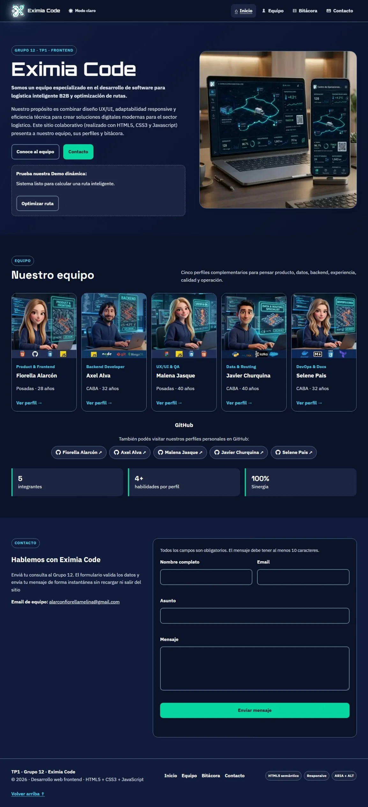

**Portada a 400 px (menú hamburguesa)**

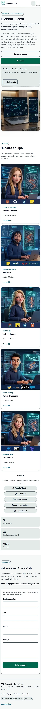

**Perfil de Fiorella a 1200 px**


**Perfil de Javier a 900 px**

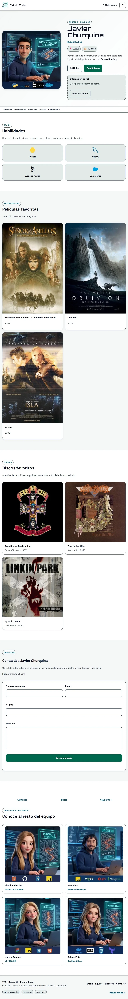

**Perfil de Malena a 400 px**

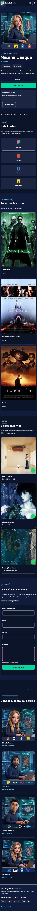

**Bitácora**

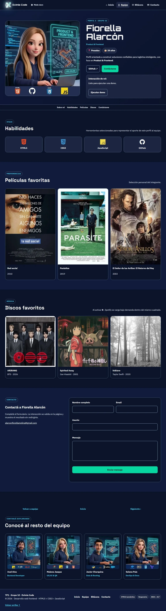

**Modo oscuro**

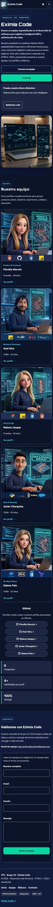

**Foco visible en el skip-link**

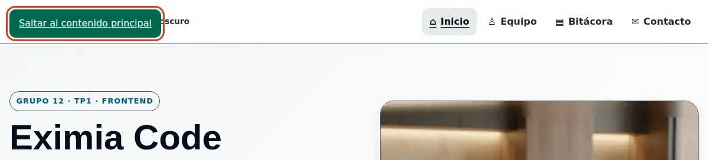

**Microinteracción en «Conocé al resto del equipo» (hover)**

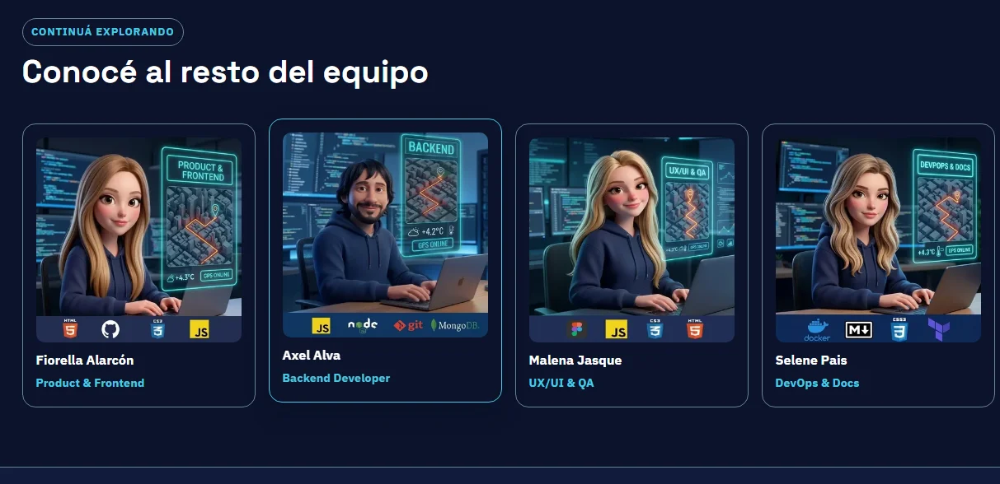

**Formulario, validaciones desde perfil grupal e individual y recibido**

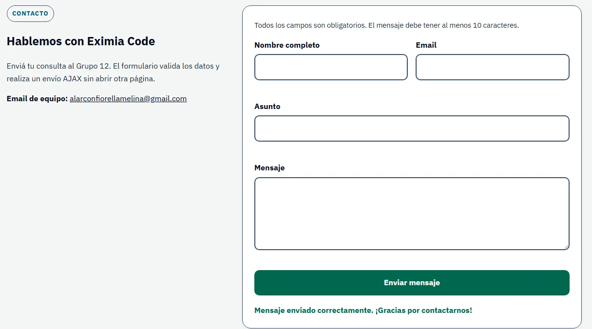

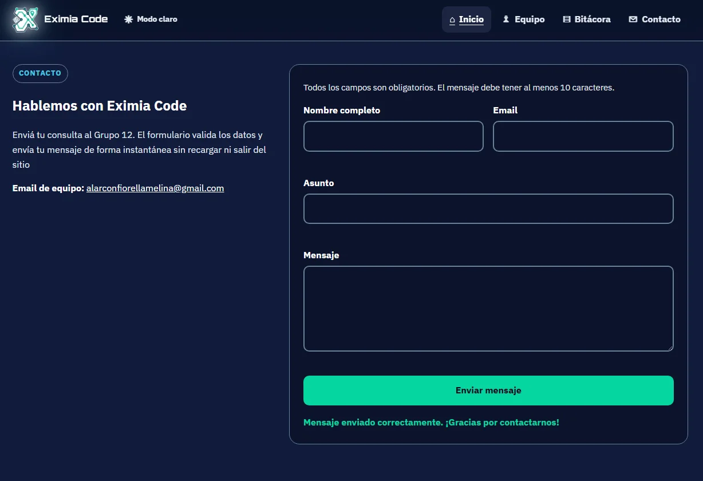

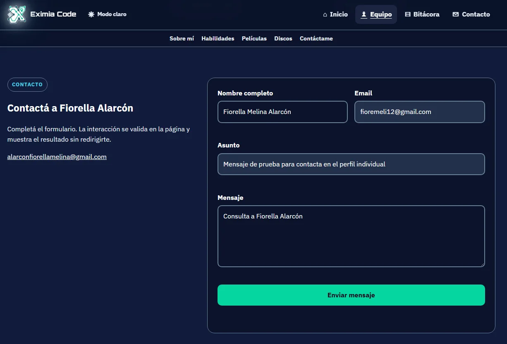

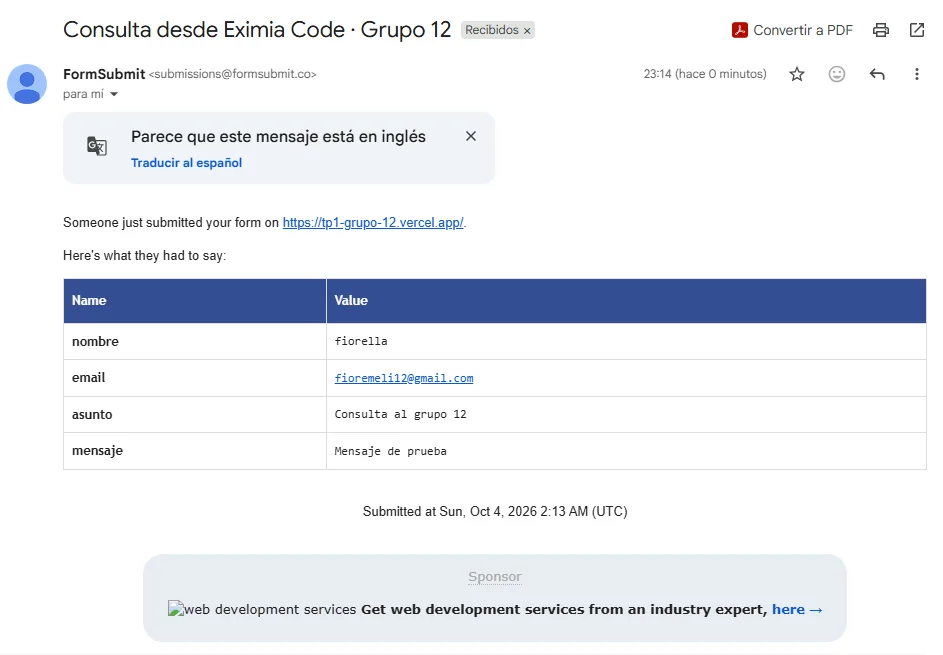

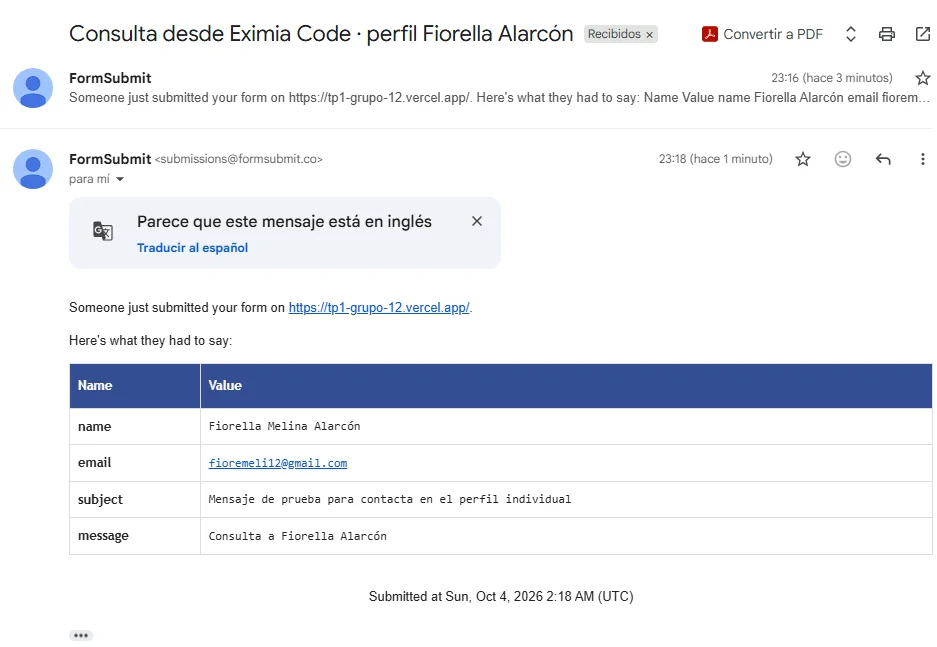

**Capturas de interacciones**

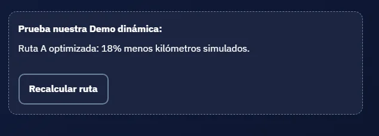

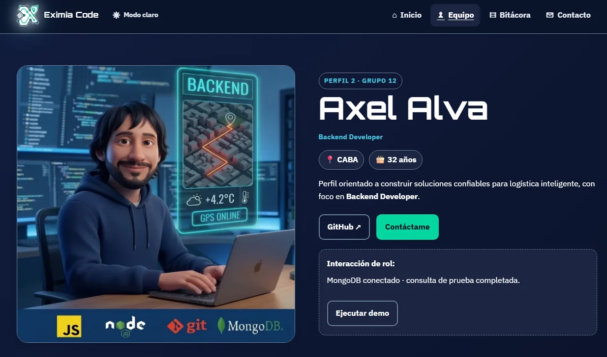

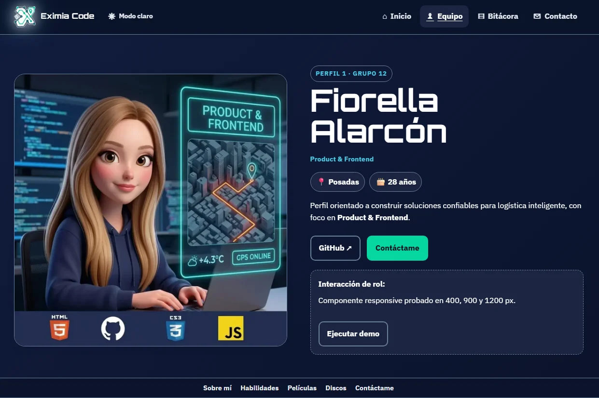

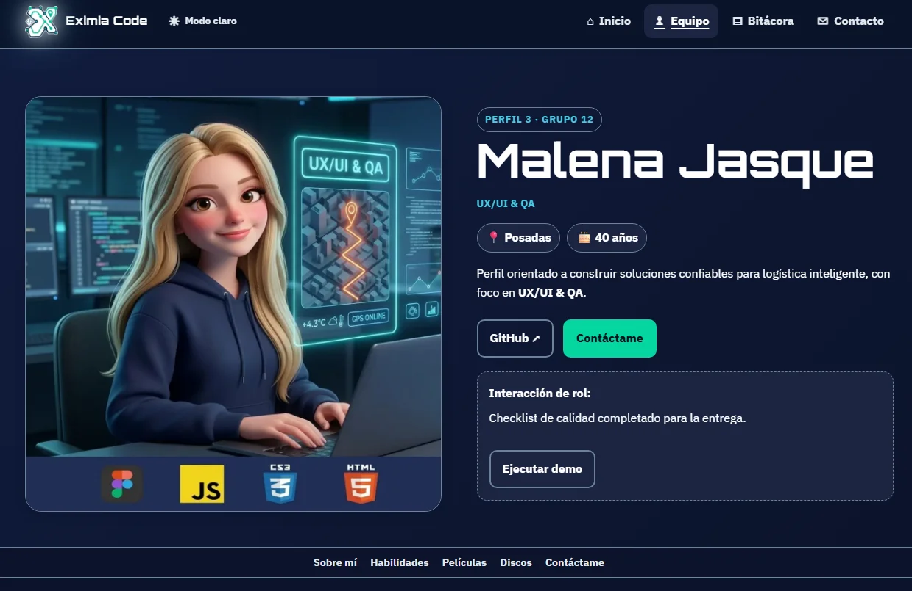

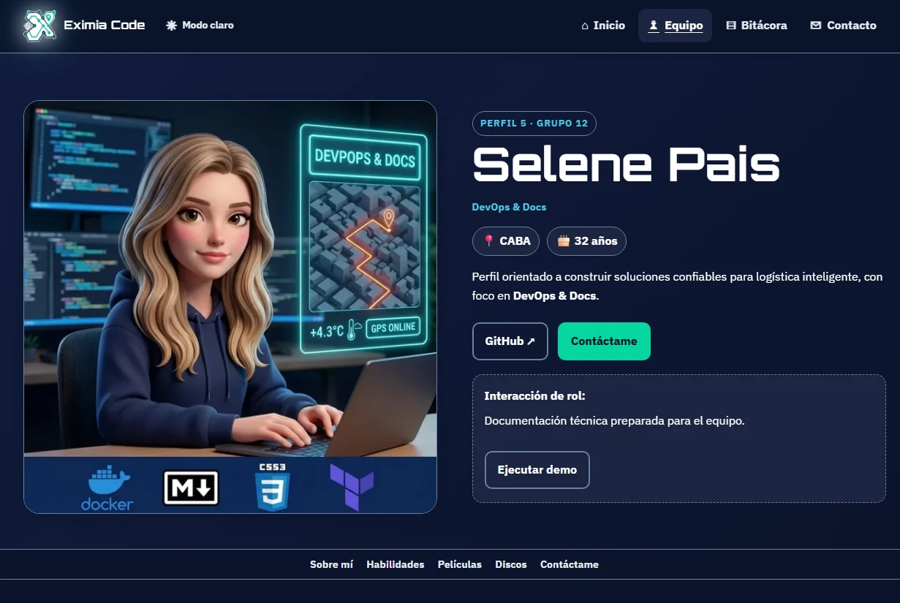

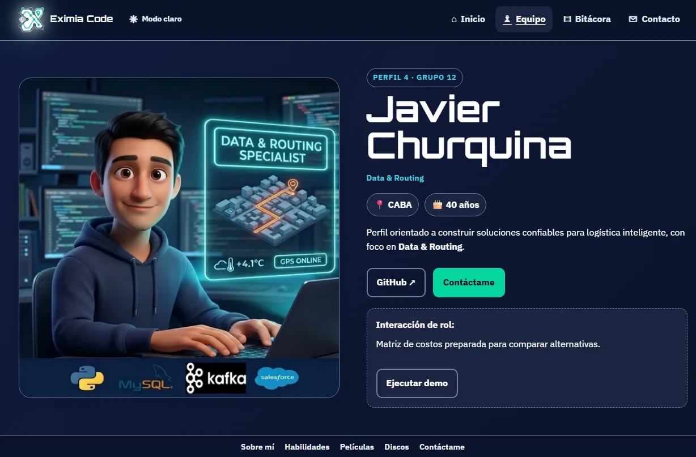

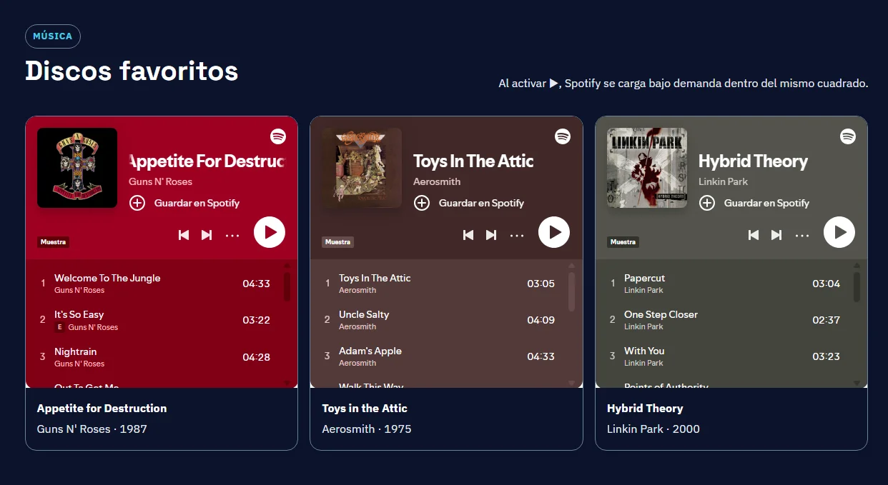


## 17. Uso de Inteligencia Artificial y autoría

La IA se utilizó como **asistente técnico y creativo**, manteniendo la revisión, selección y adaptación final bajo criterio del equipo.

### Herramienta técnica

- **ChatGPT — OpenAI, GPT-5.6 Luna.**
- **Plan:** gratuito.

Se utilizó para:

- revisar estructura semántica HTML5;
- proponer y revisar patrones responsive;
- analizar accesibilidad y navegación por teclado;
- revisar `prefers-reduced-motion`;
- detectar y corregir problemas de CSS/JavaScript;
- diseñar la lógica de las interacciones dinámicas;
- revisar formularios, estados ARIA y foco;
- documentar funciones JavaScript;
- organizar la Bitácora y el README;
- revisar decisiones UX/UI como menú hamburguesa, tarjetas clickeables y jerarquía visual.

- Para las imágenes:
- **Nano Banana 2 (gemini-3.1-flash-image)**. 
- **Plan:** gratuito.
Se utilizó para:
- Generar las imágenes del logo, panel y avatares de los integrantes del grupo.

### Qué revisó el equipo manualmente después de usar IA

*Registro final de las verificaciones realizadas antes del cierre del TP1.*

- [x] Se abrió cada página en el navegador y se comparó con la consigna.
- [x] Se leyó el código de cada archivo propio y se puede explicar qué hace.
- [x] Se probó la demo JavaScript del perfil propio y se revisaron sus frases.
- [x] Se recorrió el sitio sólo con teclado (Tab, Enter, Escape).
- [x] Se probó en un celular real y en una ventana angosta del navegador.
- [x] Se revisaron los textos del README, la bitácora y los perfiles (edad, ciudad, películas y discos favoritos) y se corrigieron.
- [x] Se verificó que cada avatar y cada imagen tenga un `alt` que describa lo que se ve.
- [x] Se revisaron los nombres de commits antes de subirlos.

### Prompts documentados

Los prompts utilizados como apoyo para logo, panel y avatares se registran en [`docs/IA-PROMPTS.md`](docs/IA-PROMPTS.md), junto con los criterios de revisión y adaptación aplicados por el equipo.

### Generación de logo y avatares

El logo de Eximia Code y los avatares/representaciones visuales de los integrantes se trabajaron mediante generación de imágenes a partir de prompts. El criterio del equipo fue utilizar una identidad coherente con software, logística, datos, tecnología y operación B2B.

En cada caso, el resultado generado fue revisado y adaptado para funcionar como recurso visual del proyecto. La elección final no se tomó automáticamente: se evaluaron legibilidad, coherencia con la paleta, relación con la identidad del grupo y comportamiento en diferentes tamaños.

### Criterio de autoría

La IA no reemplazó la toma de decisiones del equipo. El grupo definió y revisó:

- nombre e identidad de Eximia Code;
- propósito del proyecto;
- orden y contenido de perfiles;
- roles de cada integrante;
- selección de películas y discos;
- paleta visual;
- tipografías;
- estructura de navegación;
- menú responsive;
- decisión de tarjetas completamente clickeables;
- orden de tabulación;
- requisitos de accesibilidad;
- breakpoints;
- contenido de Bitácora;
- pruebas y correcciones antes de la entrega.

---

## 18. Evolución y próximos pasos · TP2

El TP1 deja una base preparada para continuar el trabajo en el TP2. La continuidad parte de las decisiones y aprendizajes ya documentados.

### Próximos pasos

- migrar la propuesta a React mediante componentes reutilizables;
- separar contenidos y presentación mediante datos locales en JSON;
- incorporar búsqueda y filtros accesibles;
- consumir una API pública y gestionar estados de carga, éxito y error;
- automatizar pruebas de enlaces, validaciones y accesibilidad cuando la nueva arquitectura lo permita;
- conservar los criterios de responsive, rendimiento, documentación y control de versiones;
- ampliar la propuesta de logística inteligente con nuevas funcionalidades.

La evolución mantendrá como prioridades la claridad, accesibilidad, responsive design, rendimiento, mantenibilidad y coherencia visual.

---

## 19. Checklist final frente a la consigna

- [x] `index.html` en la raíz del proyecto.
- [x] Cinco páginas individuales.
- [x] CSS separado en nueve archivos dentro de `css/`.
- [x] JavaScript separado en `js/`.
- [x] Imágenes en `img/`.
- [x] Portada con propósito e integrantes.
- [x] Cuatro habilidades por perfil.
- [x] Tres películas por perfil.
- [x] Tres discos por perfil.
- [x] Navegación interna.
- [x] Navegación no cíclica entre perfiles.
- [x] Interacción dinámica en portada.
- [x] Interacción dinámica en cada perfil.
- [x] Responsive a 400, 900 y 1200 px.
- [x] `prefers-reduced-motion`.
- [x] Skip link y foco visible.
- [x] Formularios accesibles.
- [x] Bitácora HTML.
- [x] README documentado.
- [x] Historial final de GitHub con participación real de los cinco integrantes.
- [x] Publicación final de Vercel desde el repositorio actualizado.
- [x] Envío real de prueba del formulario verificado.
- [x] Capturas reales agregadas al repositorio.

---

## 20. Conclusión

**Eximia Code · Grupo 12** propone una experiencia web coherente con el concepto de un equipo de desarrollo orientado a logística inteligente. El proyecto combina HTML5 semántico, CSS3, JavaScript vanilla, diseño responsive, accesibilidad, interacción dinámica y documentación del proceso.

La intención del TP1 no es únicamente presentar cinco perfiles, sino demostrar que las decisiones visuales, técnicas, de accesibilidad y de organización fueron pensadas, implementadas, probadas y documentadas de manera colaborativa.

## 21. Navegación por teclado: criterio final

El enlace **Saltar al contenido principal** enfoca el H1 de cada página, que usa `tabindex="-1"` sólo como destino programático. Después del salto, Tab continúa por los controles reales del contenido. No se usan valores positivos de `tabindex` y **no se intercepta la tecla Tab** en ningún elemento: se eliminó una captura de Tab en el último enlace del menú porque creaba una trampa de teclado (WCAG 2.1.2).

**Volver arriba ↑** desplaza el documento a `top: 0` y lleva el foco a la marca «Eximia Code» del encabezado.

## 22. Preferencias del usuario y accesibilidad ampliada

| Preferencia | Cómo responde el sitio |
|---|---|
| `prefers-reduced-motion: reduce` | sin transiciones, animaciones ni desplazamiento suave |
| `prefers-color-scheme: dark` | tema oscuro automático si no hay elección manual |
| `prefers-contrast: more` | bordes negros o blancos, sin sombras ni degradados, enlaces subrayados |
| `forced-colors: active` | bordes y foco con colores del sistema |
| `print` | se ocultan menú, formularios y controles |

Además: `<meta name="color-scheme">`, `aria-current="page"` en el menú, `aria-labelledby` en cada sección con título, enlaces externos anunciados como «se abre en una pestaña nueva», lista semántica de problemas/soluciones sin scroll horizontal y datos estructurados JSON-LD (`Organization` y `Person`).

### Animación: una sola y de baja intensidad

El sitio tiene **una única animación con `@keyframes`**, `fadeInUp`: el bloque principal de la portada y de cada perfil aparece con un fundido y 12 px de desplazamiento, una vez y en 0,5 s. Se eligió una sola a propósito, siguiendo la devolución de trabajos anteriores («bajar la carga de animaciones»).

- Sólo se activa dentro de `@media (prefers-reduced-motion: no-preference)`.
- Con `reduce`, además, la regla global de `09-accesibilidad.css` anula animaciones, transiciones y desplazamiento suave.
- No hay animaciones infinitas, pulsos, brillos ni fondos en movimiento.
- Las transiciones que existen son microinteracciones cortas (0,22 s): botones, tarjetas de equipo, tarjetas del resto del equipo y zoom leve en portadas de discos.
